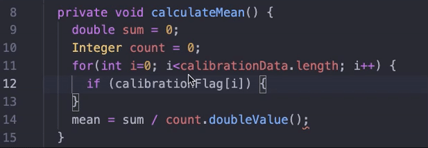

# S.I.M.O.N.

Code completion is one of the main features of modern Integrated Development Environments (IDEs). Its aim is to assist and facilitate the developer in code writing, by predicting the next code token(s) the developer is likely to write, therefore speeding up the development process. Currently, there are no tools that can be easily adapted to support different prediction models, therefore allowing researchers and practitioners to intuitively and easily experiment with different approaches, until now... This plugin allows experimenters to test their own Java code prediction neural networks in real world scenarios. The functioning of this plugin is very intuitive for the final user. The proposed neural network must be uploaded on a server that respects the simple API of the plugin. In the plugin settings, two addresses can be specified, one for the code completion neural network and one for the comment completion neural network. Once an address has been specified, it is sufficient to normally start programming and recommendations will be displayed in a non-intrusive light grey color directly in the text-editor. At this point, if the recommendation is not relevant to the context, it is sufficient to keep writing to make the suggestion gently fade away. If, on the other hand, the suggestion is relevant to the context, the user can manually write it down or accept it with a keyboard shortcut. The plugin will take care of the business of parsing the java file, understanding the position of the caret (code or comment), triggering recommendations in the correct situations and understanding when recommendations are not needed anymore
Programming is a huge discipline and it can be carried out in different ways. Sometimes plain java code is sufficient to solve a problem, but most of the times the use of external libraries and frameworks is required. Solving such a complex task as token(s) prediction requires lots of data, since a neural network, in order to be effective, must be trained in the largest amount of scenarios. Collecting huge amount of data that spans the greatest amount of use cases is one of the most challenging aspects of building such a system. For this reason, there is a feedback storing feature integrated in the plugin. An additional address can be specified in the settings. This address must lead to a server that respects the simple API of the plugin. Whenever a user accepts or rejects a suggestion, a feedback will be sent to the server. By doing so, it is possible to collect several additional data points in order to further train the network and therefore enhance its capabilities.
In order to experience the beauty of intelligent code prediction, there is no need to build your own neural network. By default the system uses an implementation of the T5 model, specifically tuned and trained by the USI Software Institute to perform token(s) prediction. T5 models represent a viable solution for code completion, outperforming even the powerful RoBERTa models, with perfect predictions ranging from ~30%, obtained when asking the model to guess entire blocks, up to ~69%, reached in the simpler scenario of few tokens masked from the same code statement.

## Features
This plugin uses a very powerful implementation of a T5 plugin to perform code and comment completion. The suggestions coming from the neural network will directly appear in the text-editor.
If you are not satisfied with the predictions coming from my model, you can easily deploy your own model on a server and specify the url in the plugin settings.

## Extension Settings
This extension contributes the following settings:

* `simon.enable`: enable/disable this extension
* `simon.urlCode`: the server hosting the neural network that makes code recommendations  
Default: `http://gym.si.usi.ch:45001/code/`
* `simon.urlComment`: the server hosting the neural network that makes comment recommendations  
Default: `http://gym.si.usi.ch:45001/comment/`
* `simon.triggerChars`: specifies the characters for which the autocompletion will be triggered  
Default: ` " ", ".", ",", "(" `
* `simon.name`: insert your organization name when requesting a recommendation (optional)
* `simon.urlFeedback`: the server hosting the feedback database  
Default: `http://gym.si.usi.ch:45002/feedback/`
* `simon.suggestionColor`: the color of the suggestion is hexadecimal  
Default: `#505050`  
I suggest to keep this subtle
* `simon.confidenceCode`: the minimum confidence that the code neural network must have in order for a recommendation to be shown  
Default: `75`
* `simon.confidenceComment`: the minimum confidence that comment neural network must have in order for a recommendation to be shown  
Default: `75`
* `simon.singleLineComment`: enable/disable to move a single line comment on the same line of some code, to a new line when the code is sent to the neural network  
Default: `True`

## Commands
These are the default commands of the extension. The following keys change behavior depending on the context. This means that it will still be possible to indent code using `tab`, only when there is a recommendations showing, this key will change its behavior. This same reasoning can be applied to all the other shortcuts.
* `escape`: make the showing suggestion fade away
* `tab`: accept a suggestion
* `ctrl+space`: manually invoke the neural network

## Folder structure

- **`package.json`** - this is the manifest file in which you declare your extension and command. The plugin registers a command and defines its title and command name. With this information VS Code can show the command in the command palette.
- **`src/`**: this folder contains all the javascript code to make the plugin work
- **`language-configuration.json`**: file that disables automatic parenthesis closing. Necessary for the correct operation of the plugin
- **`report.pdf`**: pdf file containing a very detailed description of the project

-----------------------------------------------------------------------------------------------------------

**Note:** This plugin will turn-off automatic closing of (, [ and {
